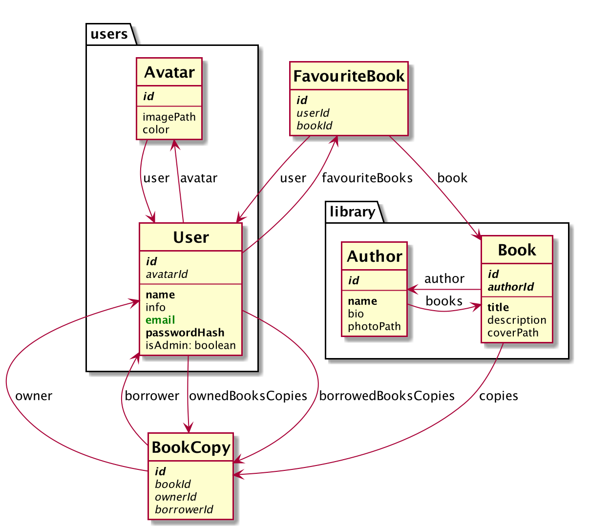

# Bookshelf

Example react and GraphQL project made during https://kursreacta.pl/gql course.

https://graphql-bookshelf.herokuapp.com/

## Prerequisites

1. Install Node.js version 18.15.0.
2. Running PostgreSQL on port `5432`.
3. Create `bookshelf_development` database with current user access.

## Installation and running

1. `yarn install`
2. `yarn build`
3. `yarn dev` - will run express dev server along with webpack.
4. `yarn workspace @bookshelf/web storybook`

Navigate to http://localhost:8080/ to see the app.

Navigate to http://localhost:4000/ to see GraphQL Playground.

## Database

